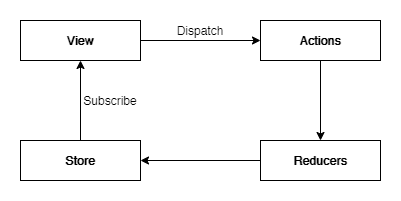
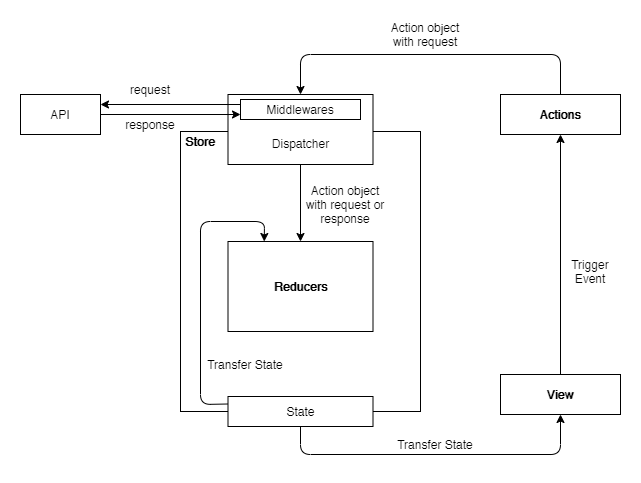
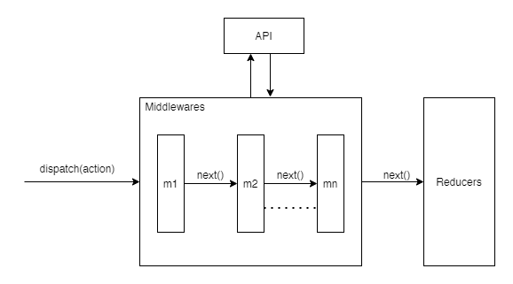

# Redux with react

## What is Redux?

A Redux is a open-source cross-platform JavaScript library that is used to manage the state of the application. Created by Dan Abramov and Andrew Clark.

It becomes a difficult task to keep maintain the data flow of the large application. Redux solves this problem by manaing application's state with a single global object called Store.

<!--  <br /> -->
<div align="center">
    
    <br />
    <span><strong >Figure 1:</strong> Redux core concept</span>
</div>

## Setup React App

`$ create-react-app redux-with-react-example` <br />
`$ cd redux-app` <br />

To run: <br />
`$ npm start`

## Redux Installation

`$ npm install --save redux react-redux redux-thunk` <br />

---

## Terms used in Redux

## 1. State

State is a build-in JavaScript object that all react component has. This object is used to store the property values of the component. State can only be used within a class component and each component can maintain its own state. Every time when the state object is changed, the component will be re-rendered.

## 2. Action

Action is a simple JavaScript object that holds information about "what happended" and carries it from application to store. An action must be of action type( i.e. to indicate the type of action performed) and the payload (i.e other properties of component or object).

Example: <br />
`{ type: ACTION_TYPE, payload: {...}}`

Action Type: It should be a string constant determining the specific task or action.

Example:
In src/store/authAction.js file.

```js
import Axios from "axios"

// Action Types
const LOGIN_START = "LOGIN_START"
const LOGIN_SUCCESS = "LOGIN_SUCCESS"
const LOGIN_FAIL = "LOGIN_FAIL"
const LOGOUT = "LOGOUT"

// Action Creators
export function loginStart() {
  // Action Object
  return {
    type: LOGIN_START,
    isLoading: true,
    token: null,
    error: null,
    isAuthenticated: false,
    alert: null,
  }
}

export function loginSuccess(token) {
  return {
    type: LOGIN_SUCCESS,
    isLoading: false,
    token: token,
    error: null,
    isAuthenticated: true,
    alert: null,
  }
}

export function loginFail(error) {
  return {
    type: LOGIN_FAIL,
    isLoading: false,
    token: null,
    error: error,
    isAuthenticated: false,
    alert: {
      type: "ERROR",
      message: error.message,
    },
  }
}

export function logout() {
  localStorage.removeItem("token")
  return {
    type: LOGOUT,
    isLoading: false,
    token: null,
    error: null,
    isAuthenticated: false,
    alert: null,
  }
}

// Action with dispatch
export function login(username, password) {
  let payload = {
    username: username,
    password: password,
  }
  return (dispatch) => {
    dispatch(loginStart())
    // API call
    Axios.post("http://127.0.0.1:8000/api/login/", payload)
      .then((res) => {
        const token = res.data.token
        localStorage.setItem("token", token)
        setTimeout(() => {
          dispatch(loginSuccess(token))
        }, 2000)
      })
      .catch((error) => {
        dispatch(loginFail(error.response.data))
      })
  }
}

export function isAuthenticate() {
  const token = localStorage.getItem("token")
  const isAuthenticated =
    token && "YXV0aG9yOiBTaHJlZWphbCBTaGFreWE=" === token ? true : false
  return isAuthenticated
}
```

## 3. Reducer

Reducer is a JavaScript pure function that make changes to or update the applicaion state according to the actions. Reducer takes previous state and an action being dispatched, and returns the next state. Reducers should always be a pure function i.e. it should not have any non-pure functions, API calls and routing logics or any mutation of functions argumets.

```html
(previousState = initialState, action) => newState
```

Example:
In src/store/authReducer.js file.

```js
import { isAuthenticate } from "./authAction"

// Action Types
const LOGIN_START = "LOGIN_START"
const LOGIN_SUCCESS = "LOGIN_SUCCESS"
const LOGIN_FAIL = "LOGIN_FAIL"
const LOGOUT = "LOGOUT"

// if no inital state is set then redux reducer will return undefined state.
const initialState = {
  isLoading: false,
  token: localStorage.getItem("token"),
  error: null,
  isAuthenticated: isAuthenticate(),
  alert: null,
}

const loginStart = (state, action) => {
  // update properties of state
  let nextState = {
    isLoading: action.isLoading,
    isAuthenticated: action.isAuthenticated,
  }
  // return {...state, ...nextState}
  return Object.assign({}, state, nextState)
}

const loginSuccess = (state, action) => {
  let nextState = {
    isLoading: action.isLoading,
    token: action.token,
    isAuthenticated: action.isAuthenticated,
    alert: action.alert,
  }
  return Object.assign({}, state, nextState)
}

const loginFail = (state, action) => {
  let nextState = {
    isLoading: action.isLoading,
    error: action.error,
    isAuthenticated: action.isAuthenticated,
    alert: action.alert,
  }
  return Object.assign({}, state, nextState)
}

const logout = (state, action) => {
  let nextState = {
    token: action.token,
    isAuthenticated: action.isAuthenticated,
    alert: action.alert,
  }
  return Object.assign({}, state, nextState)
}

const authReducer = (state = initialState, action) => {
  switch (action.type) {
    case LOGIN_START:
      return loginStart(state, action)
    case LOGIN_SUCCESS:
      return loginSuccess(state, action)
    case LOGIN_FAIL:
      return loginFail(state, action)
    case LOGOUT:
      return logout(state, action)
    default:
      return state
  }
}

export default authReducer
```

We can use multiple reducers using combineReducers().

Syntax:

```js
combineReducers(reducers)
```

Example:
In src/store/reducers.js file.

```js
import { combineReducers } from "redux"
import authReducer from "./authReducer"

const rootReducer = combineReducers({
  authReducer,
})

export default rootReducer
```

`combineReducers()` combines seperate reducers state tree in a single state tree. Each reducer maintains their own state tree.

Example: <br />
In reducers.js file

```js
function reducer1(state = [], action) {
  return nextState
}

function reducer2(state = [], action) {
  return nextState
}

const reducers = combineReducers({
  reducer1,
  reducer2,
})
```

Whenever an action emitted, application reducers will call all combined reducers, combine the state result and return a single state tree.

Example:

```js
{
  "reducer1": nextState,
  "reducer2": nextState
}
```

## 4. Store

Store is just JavaScript object, a single global object that hold the application state. There should be a single store in a redux application.

`store.getState()` - allows access to state. <br />
`store.dispatch()` - allows to update state. <br />
`store.subscribe(listener)` - register listener and return function for unregistering the listener. <br />

Example of Suscribe:

```js
// Every time the state changes, log it
// Note that subscribe() returns a function for unregistering the listener
const unsubscribe = store.subscribe(() => console.log(store.getState()))

// Dispatch some actions
// store.dispatch(...)
//...

// Stop listening to state updates
unsubscribe()
```

Example:
In src/index.js file.

```js
import React from "react"
import "./index.css"
import App from "./App"
import * as serviceWorker from "./serviceWorker"

import { createStore, compose, applyMiddleware } from "redux"
import { Provider } from "react-redux"
import thunk from "redux-thunk"
import ReactDOM from "react-dom"

import rootReducer from "./store/reducers"

const composeEnhances = window.__REDUX_DEVTOOLS_EXTENSION_COMPOSE__ || compose

const store = createStore(rootReducer, composeEnhances(applyMiddleware(thunk)))

const app = (
  <Provider store={store}>
    <App />
  </Provider>
)

ReactDOM.render(app, document.getElementById("root"))

serviceWorker.unregister()
```

### 1. createStore(reducer: Function, [preloadedState]: any, [enhancer]: Function)

It create a Redux store that hold the complete state tree of the application.

`reducer` - A reducer function that return the next state tree.
`[preloadedState]` - The initial state that can be use to sync the state from the server or to restore a previous state.
`[enhancer]` - The store enhancer to enhance the store capabilities using third-party library such as middleware, time travel, etc. The only store enhancer that ships with Redux is applyMiddleware().

### 2. Provider Tag

All container components need access to the redux store. So, it can be tedious task to provide store to each container components. Here, we use `<Provider>`, a special react redux component that provide store to all container components in the application without passsing it explicitly.

---

## View

Example: In src/login/login.js

```js
import React, { Component } from "react"
import { connect } from "react-redux"

import "./login.css"
import avatar from "./img_avatar2.png"
import { login as loginAction } from "../store/authAction"
import Spinner from "../spinner/spinner"
import Alert from "../alert/alert"

class Login extends Component {
  componentDidMount() {
    this.redirectIfAuthenticated(this.props)
  }

  componentWillReceiveProps(newProps) {
    this.redirectIfAuthenticated(newProps)
  }

  redirectIfAuthenticated(props) {
    if (props.isAuthenticated) {
      this.props.history.push({
        pathname: "/",
        state: { from: { pathname: "/login" } },
      })
    }
  }

  submit = (event) => {
    event.preventDefault()
    let uname = event.target.elements.uname.value
    let psw = event.target.elements.psw.value
    this.props.login(uname, psw)
  }

  render() {
    let alert_box =
      this.props.error !== null ? (
        <Alert type={this.props.alert.type} message={this.props.alert.message} />
      ) : null

    return (
      <div id="page-content" className="animate-bottom">
        {this.props.isLoading ? (
          <Spinner />
        ) : (
          <div style={{ margin: "0px auto", marginTop: "40px", width: "500px" }}>
            {alert_box}
            <form onSubmitCapture={(event) => this.submit(event)}>
              <div className="imgcontainer">
                
              </div>

              <div className="container">
                <label htmlFor="uname">
                  <b>Username</b>
                </label>
                <input type="text" placeholder="Enter Username" name="uname" required />

                <label htmlFor="psw">
                  <b>Password</b>
                </label>
                <input type="password" placeholder="Enter Password" name="psw" required />

                <button type="submit">Login</button>
              </div>

              <div className="container" style={{ backgroundColor: "#f1f1f1" }}>
                <button type="button" className="cancelbtn">
                  Cancel
                </button>
              </div>
            </form>
          </div>
        )}
      </div>
    )
  }
}

const mapStateToProps = (state) => {
  return {
    isLoading: state.authReducer.isLoading,
    token: state.authReducer.token,
    error: state.authReducer.error,
    isAuthenticated: state.authReducer.isAuthenticated,
    alert: state.authReducer.alert,
  }
}

const mapDispatchToProps = (dispatch) => {
  return {
    login: (username, password) => dispatch(loginAction(username, password)),
  }
}

export default connect(mapStateToProps, mapDispatchToProps)(Login)
```

Now, to connent the react components with the redux store. We use `connect()` function. It is a very useful function provided by `react-redux`. It is used to connect the store with the latest state and also to dispatch the actions to the store.

Syntax:

```js
function connect(mapStateToProps?, mapDispatchToProps?, mergeProps?, options?)
```

### 1. mapStateToProps?: (state, ownProps?) => object

`mapStateToProps` is a function that will suscribe to Redux store updates. When the store is updated, this function willl be called with the latest state and finally the result from it will be merged into the wrapped component's props.

`state` - The latest state form the store.
`ownProps` (optional) - The wrapper component's props. When second parameter available to `mapStateToProps` then function will also be called when the wrapper component receives new props.

### 2. mapDispatchToProps?: object | (dispatch, ownProps?) => object

`mapDispatchToProps` is a function or object contain the dispatchers or action creators required to the component. These dispatchers will dispatch an action to the store.

`dispatch` - The dispatch function of the store.
`ownProps` (optional) - The wrapper component's props. When second parameter available to `mapDispatchToProps` then function will also be called when the wrapper component receives new props.

`Action Creator` = It is a function that creates an action. An action is a payload of information that describe what happened, and an action creator is a factory that creates an action.

Example:

```js
function login(username, password) {
  return {
    type: LOGIN,
    isLoading: false,
    payload: {
      username: username,
      password: password,
    },
  }
}

dispatch(login(username, password))
```

Action creators may often trigger a dispatch when invoked:
Example:

```js
function login(username, password) {
  const loginAction = {
    type: LOGIN,
    isLoading: false,
    payload: {
      username: username,
      password: password,
    },
  }
  dispatch(loginAction)
}
```

Here, we have direct returned action creators in `mapDispatchToProps`:

```js
return {
  login: (username, password) => dispatch(loginAction(username, password)),
}
```

### 3. mergeProps?: (stateProps, dispatchProps, ownProps) => object

It defines the final props for the wrapped component. The result from this is a plain object that will be used as the props for the wrapped component. So, It is a handy function where we can define the final ouput of the props that we gonna use in the component.

### 4. options?: object

Here, we can define context for the component and other may more.

```js
{
  context?: Object,
  pure?: boolean,
  areStatesEqual?: Function,
  areOwnPropsEqual?: Function,
  areStatePropsEqual?: Function,
  areMergedPropsEqual?: Function,
  forwardRef?: boolean,
}
```

---

## Data Flow

<div align="center">
    
    <br />
    <span><strong >Figure 2:</strong> Redux data flow</span>
</div>

- From view, an event is triggered when a user interacts with the application. This event is an action that is dispatched using `store.dispatch(action)`. An action is a plain object describing what happened.
- Next, store calls the reducer functions according to the action provided. Store pass two arguments to the reducer i.e. current state and action. Reducer is the pure function that computes the next state and return it.
- `combineReducer()` or root reducer will combine the state in a single state tree and return it.
- Store saves the result returned by the root reducer i.e. single state tree. Now, every listener registered with `store.suscribe(listener)` will be invoked with the new state from store.
- Finally, view will be re-render with the new state invoked.

---

## Middleware

Middleware is the feature provided by the redux to extend the capability and to implement custom feature into the Redux process. It is a medium to interact with dispatched action before they reach to the reducer. When an action is dispatched, the action goes through a (or many) middleware before hitting the reducer.

Another important use of middleware is to support asynchronous actions without much boilerplate code.

Syntax:

```js
applyMiddleware(...middleware)
```

<div align="center">
    
    <br />
    <span><strong >Figure 3:</strong> Redux middleware process</span>
</div>

## Most used middleware: redux-thunk

Exactly, in computer programming, the term `thunk` refers to a sub-routine or a function that is returned by another function.

```js
function parentFxn() {
  return function thunk() {
    // DO YOUR STUFF HERE...
  }
}
function parent2Fxn() {
  return () => {
    // thunk
    // DO YOUR STUFF HERE...
  }
}

// To call or execute it.
parentFxn()()
parent2Fxn()()
```

<br />

<pre>
Thunk is a function that wraps an expression to delay its evaluation.

// calculation of 1 + 2 is immediate
// x === 3
let x = 1 + 2;

// calculation of 1 + 2 is delayed
// foo can be called later to perform the calculation
// foo is a thunk!
let foo = () => 1 + 2;

reference: https://github.com/reduxjs/redux-thunk
</pre>

[ reference: [redux-thunk](https://github.com/reduxjs/redux-thunk) ]

## How redux-thunk works?

As we know, actions are just a JavaScript plain object that actually do nothing and reducers are the executor but needs to be a pure function that don't make changes outside their scope. In this scenario where we need to get data from outside somewhere like fetch data from server using API call, we cannot do that in reducer. So, here comes redux-thunk, which calls the function that does it.

Like in our app `login()` action function does:

```js
export function login(username, password) {
  let payload = {
    username: username,
    password: password,
  }
  return (dispatch) => {
    dispatch(loginStart())
    // API call
    return Axios.post("http://127.0.0.1:8000/api/login/", payload)
      .then((res) => {
        const token = res.data.token
        localStorage.setItem("token", token)
        setTimeout(() => {
          dispatch(loginSuccess(token))
        }, 2000)
      })
      .catch((error) => {
        dispatch(loginFail(error.response.data))
      })
  }
}
```

Here, we have returned a function that calls API instead of plan object. So, redux-thunk looks for every action dispatched and if it's a function then it will call that function and return the result. And dispatched action is object then it will return as it is.

So, here is the redux-thunk code that what its does:

```js
function createThunkMiddleware(extraArgument) {
  return ({ dispatch, getState }) => (next) => (action) => {
    if (typeof action === "function") {
      return action(dispatch, getState, extraArgument)
    }

    return next(action)
  }
}

const thunk = createThunkMiddleware()
thunk.withExtraArgument = createThunkMiddleware

export default thunk
```

## Custom Middleware

As we have seen that middleware is just a piece of code that does a specific task sitting between action and reducer, we can create our own middleware.

Let's create a logger for our application:

Example: In src/store/middleware/logger.js file

```js
function createLoggerMiddleware() {
  return ({ getState }) => (next) => (action) => {
    console.log("Dispatching action: ", action)

    // next() call's other middleware in the chain and return
    // action or updated action if any changes made by other middlewares.
    const updatedAction = next(action)

    console.log("New state: ", getState())
    return updatedAction
  }
}

const logger = createLoggerMiddleware()

export default logger
```

Register logger middleware in application Redux, lets update index.js file:
Example: In src/index.js file

```js
// ...
import logger from "./store/middleware/logger"
// ...
// Just add logger before thunk.
const store = createStore(rootReducer, composeEnhances(applyMiddleware(logger, thunk)))
// ...
```

Here, so simple, instead of logging for each action dispatcher it will log for all. Thats how middlware helps to simplify our code and get rid of boilerplate code.

---
